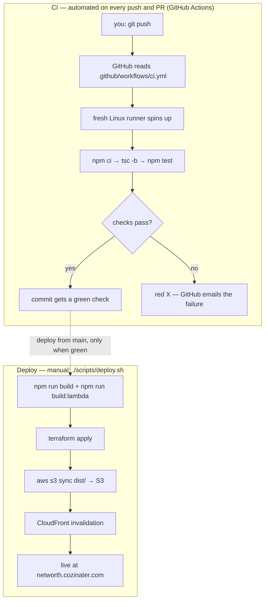

# ToTheMoon


A React + TypeScript + Vite app.

## Tech stack

- **React 19** + **TypeScript** + **Vite**
- **TanStack Router** — routing (code-based)
- **TanStack Query** — server state / data fetching & caching
- **TanStack Table** — data tables
- **React Hook Form** — forms
- **Tailwind CSS v4** + **shadcn/ui** (Radix) — styling & components
- **Lucide** — icons

## Getting started

```bash
npm install
npm run dev      # start the dev server
npm run build    # typecheck + production build
npm run lint     # run ESLint
npm run preview  # preview the production build
```

## Project structure

The app is organized **by feature**: shared building blocks live at the top of
`src/`, and each domain of the app gets its own self-contained folder under
`features/`. Dependencies point downward — routes use features, features use
shared components and `lib`, and `components/ui` depends on nothing of ours.

```
src/
├── main.tsx              # entry: QueryClientProvider + RouterProvider, imports global CSS
├── router.tsx            # code-based route tree (createRouter)
├── App.css               # global styles: Tailwind + shadcn theme imports
├── routes/               # one file per route (URL → page)
│   ├── __root.tsx        #   app shell: <Outlet/> + router devtools
│   └── index.tsx         #   "/" home page
├── features/             # one folder per domain (added as the app grows)
│   └── <name>/
│       ├── components/   #   UI used only by this feature
│       ├── api/          #   TanStack Query queryOptions + fetch functions
│       ├── hooks/        #   feature hooks (useQuery / useMutation wrappers)
│       └── types.ts      #   feature-specific types
├── components/
│   ├── ui/               # shadcn primitives (managed by the shadcn CLI)
│   └── layout/           # app shell pieces: header, sidebar, footer…
├── hooks/                # app-wide React hooks
├── lib/                  # plumbing with no UI
│   ├── query-client.ts   #   shared QueryClient
│   └── utils.ts          #   shadcn cn() helper
├── types/                # shared TypeScript types
└── assets/               # static assets imported by code
```

### Conventions

- **Keep code where it's used.** Feature-specific components, hooks, and types
  live in that feature's folder. Only promote something to the top-level
  `components/`, `hooks/`, `lib/`, or `types/` once a *second* feature needs it.
- **Path alias:** `@/` resolves to `src/` (e.g. `import { cn } from "@/lib/utils"`).
- **Adding a route:** create a file in `src/routes/` and register it in
  `src/router.tsx`. (To switch to file-based routing, install
  `@tanstack/router-plugin` and wire it into `vite.config.ts`.)
- **Adding a component:** use the shadcn CLI — it drops primitives into
  `src/components/ui/`. Don't hand-edit those.

## Configuration

- `server/.env` (local dev): copy `server/.env.example`, add your Twelve Data API key.
- `infra/terraform.tfvars` (deploy): copy `infra/terraform.tfvars.example` — basic-auth
  credentials, a long random `origin_secret`, and the Twelve Data key. Both files are gitignored.

## CI/CD pipeline

Two separate flows. **CI** (GitHub Actions) checks every change automatically;
**deploying** ships to production and stays a manual, deliberate step.



CI answers "did this change break anything?" on a clean machine, so nothing
depends on what happens to be installed locally. Deploys are gated on a green
main but always triggered by you.

## Deploying

One-time: `terraform -chdir=infra init`, AWS credentials configured (`aws configure`), and
`infra/terraform.tfvars` filled in.

Then every deploy is:

```bash
./scripts/deploy.sh
```

It builds the SPA and Lambda, `terraform apply`s infra + code, syncs `dist/` to S3, and
invalidates `index.html`. The app is served at the CloudFront URL behind HTTP Basic auth.
