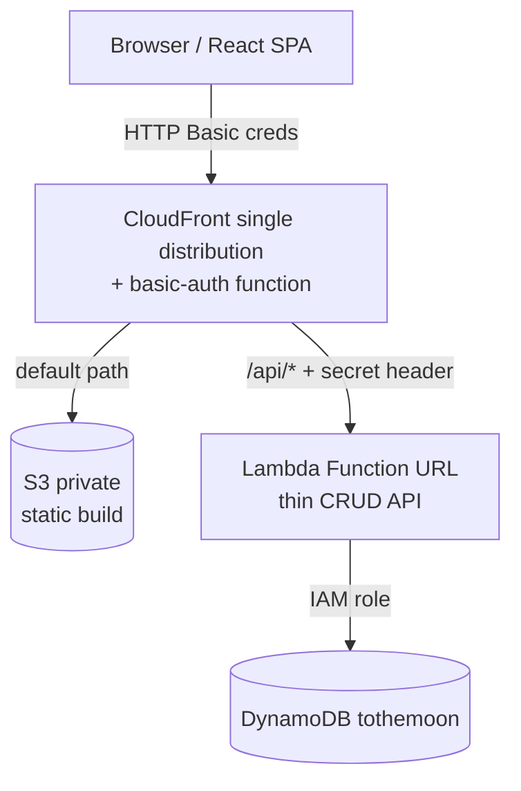

# ToTheMoon — AWS Architecture

Always-free AWS stack. One CloudFront distribution fronts both the static site
and the API, so the API is same-origin (no CORS) and there is a single place to
handle auth. Region: **ap-southeast-1** (Singapore).

## Request flow

## Components

- **CloudFront** — single distribution, two origins. Default behaviour serves
  the SPA from S3; `/api/*` routes to the Lambda. A CloudFront **Function**
  (viewer-request) enforces HTTP Basic auth on every request, covering both the
  site and the API.
- **S3** — private bucket, no public access. Reached only via CloudFront using
  Origin Access Control (OAC).
- **Lambda** — single Node/TS function with a Function URL, simple method+path
  routing (list all / get one / put / delete). AWS SDK v3
  `DynamoDBDocumentClient`.
- **DynamoDB** — `tothemoon` table (`pk="USER"`, `sk="YYYY-MM"`, holdings
  embedded). Provisioned at low capacity (under the 25 RCU / 25 WCU free
  ceiling) to stay strictly $0.
- **IAM** — Lambda execution role scoped to CRUD on just that one table.

## API structure

**One Lambda** handling all routes via internal routing (method + path), not a
function per endpoint. Reasons: a Function URL is 1:1 with a function, so one
Lambda = one URL = one clean CloudFront `/api/*` origin (multiple functions
would force multiple CloudFront origins or an API Gateway routing layer, adding
cost and complexity); and the API is a single resource (snapshots) with a few
verbs — list / get / put / delete.

Split a route into its own function only when concerns **diverge** (very
different IAM, a heavier runtime/memory profile, independent scaling, or
isolation) — not because the route count grows. One function handles many routes
fine.

Routing: a plain `switch` on method+path (zero deps) is sufficient; **Hono** is
a light alternative that also gives a clean place for the origin-secret check as
middleware.

Lambda stack: **TypeScript on `nodejs22.x`, arm64**. Hono (or plain switch) for
routing; AWS SDK v3 (`@aws-sdk/client-dynamodb` + `@aws-sdk/lib-dynamodb`
DocumentClient, pinned and bundled, not the runtime copy); **Zod** to validate
incoming JSON before writes; **esbuild** to bundle to a single zipped artifact
for Terraform. Share the `MonthlySnapshot` / `Holding` types with the frontend.

## Auth (basic auth, single user)

Two layers, because basic auth alone would leave the Lambda URL exposed:

1. **Human gate** — CloudFront Function checks the `Authorization` header for
   HTTP Basic credentials and returns 401 if missing/wrong. The browser's native
   login prompt handles the UX; the SPA does nothing. Credential is templated
   into the function code at deploy from a Terraform variable.
2. **Origin gate** — CloudFront injects a secret custom header on origin
   requests to the Lambda; the Lambda rejects (403) anything without it. This
   stops anyone hitting the Function URL directly and bypassing the human gate.

Both secrets come from Terraform variables (marked sensitive, kept out of the
committed repo — use a local `*.tfvars` or environment).

Caveats, all acceptable for a personal single-user app: basic auth sends the
credential (base64) on every request (fine over HTTPS, which CloudFront is); it
is one shared credential with no expiry or per-user identity. If this ever needs
multiple users or sharing, swap layer 1 for Cognito.

## Terraform

Flat root module is fine for a solo project; split by file for readability:

- `dynamodb.tf` — `aws_dynamodb_table`
- `lambda.tf` — `aws_iam_role` + policy, `aws_lambda_function`,
  `aws_lambda_function_url`
- `s3.tf` — private `aws_s3_bucket`, OAC, bucket policy
- `cloudfront.tf` — `aws_cloudfront_function` (basic auth, templated with the
  credential var), `aws_cloudfront_origin_access_control`,
  `aws_cloudfront_distribution` (two origins/behaviours, function attached on
  viewer-request, secret header on the Lambda origin)
- `variables.tf` — `basic_auth_user`, `basic_auth_password`, `origin_secret`
  (all sensitive)
- `outputs.tf` — CloudFront domain, table name

Notes:
- **State**: local backend is fine to start; move to an S3 backend + lock table
  later if wanted.
- **No custom domain** keeps it $0 — use the default `*.cloudfront.net` URL. A
  custom domain adds a Route 53 hosted zone (~$0.50/mo) and needs an ACM cert in
  **us-east-1** (separate provider alias).
- **App deploys live outside Terraform**: TF provisions infra; a small script
  does `npm run build` → `aws s3 sync` → CloudFront invalidation. The Lambda zip
  is built and pointed at via `aws_lambda_function` (`source_code_hash`).

## Cost

$0/month on the default domain: CloudFront (1 TB out + 10M requests free),
Lambda (1M requests free), DynamoDB (free tier), CloudFront Functions (generous
free tier), S3 pennies at this size. The only paid item would be a custom
domain's hosted zone.
